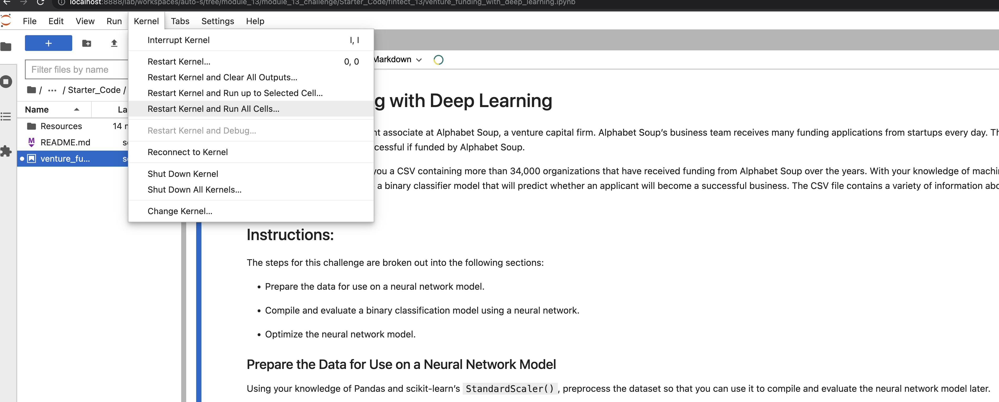

# VENTURE FUNDING WITH DEEP LEARNING

-
## Table of Contents

1. Project Motivation
2. About the Application
3. How to Run
4. File Descriptions
5. License

## Project Motivation
This project is in completion of the Columbia University FinTech 2022 bootcamp module thirteen weekly challenge exercise.

---

## About the Application
Python code is use to process data, build, train and test neural network models, used by Alphabet Soup Inc to predict whether applicants, asking for funcding will be successful if funded by the company.

---
## How to Run
Follow steps in the snippet below to install libaries, and to run the application.

```
git clone <link to repo>
open and run venture_funding_with_deep_learning.ipynb 
<see below image>

```




## File Descriptions
There are one folders, one sub-folder and one file in the fintech_11 folder:
1. Starter_Code
 - venture_funding_with_deep_learning.ipynb
 - Resources
   - applicants_data.csv
   - how_to_run.png
   - AlphabetSoup.h5
   - AlphabetSoup_A1.h5
   - AlphabetSoup_A2.h5

2. README.md
3. requirements.txt


    
## License
This project is in completion of the Columbia University FinTech 2022 bootcamp module thirteen weekly challenge exercise. It should not be copied and used for commercial purpose without the authorization of the admin on this repo. For futher information please contact Patrick via email on pruejoma@gmail.com